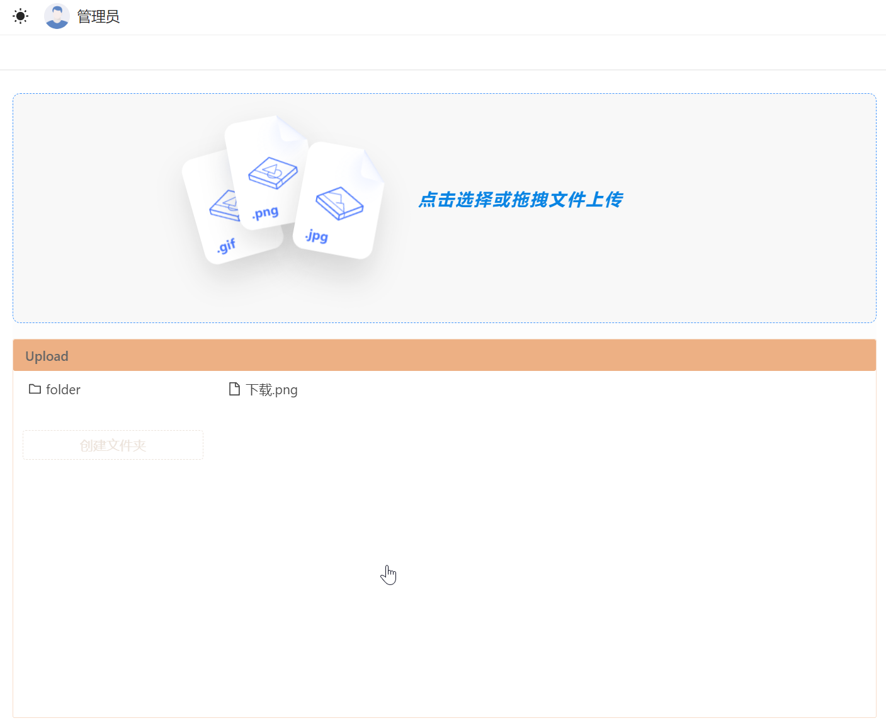

# 文件上传自动部署

带有简易文件管理的自动部署工具



## 编译运行

```bash
cd deploy_go
go mod tidy

cd cmd
go build && ./cmd
```

## 使用

浏览器访问 http://localhost:8066/

## 配置文件

用户：user.json

```json
[
    {"user": "admin", "password": "admin123456"}
]
```

部署规则：deploy.json

```json
{
    "path": "./Upload",
    "env": {
        "blog": "~/web/blog",
        "blog_content": "~/web/blog/content",
        "web": "~/web/site",
        "upload": "~/Upload"
    },
    "items": [
        {
            "path": "*.png",
            "actions": [
                "echo file {$FILE} uploaded."
            ]
        },
        {
            "path": "*.go",
            "actions": [
                "dir {$FILE}"
            ]
        },
        {
            "path": "server",
            "actions": [
                "killall server",
                "mv {$FILE} {$web}",
                "{$web} => ./server &"
            ]
        },
        {
            "path": "post.zip",
            "actions": [
                "mv {$FILE} {$blog_content}",
                "killall hugo",
                "{$blog_content} => mv post_backup.zip -r post/ && rm -rf post/",
                "{$blog_content} => unzip {$FILE}",
                "killall hugo && hugo server &"
            ]
        }
    ]
}
```
